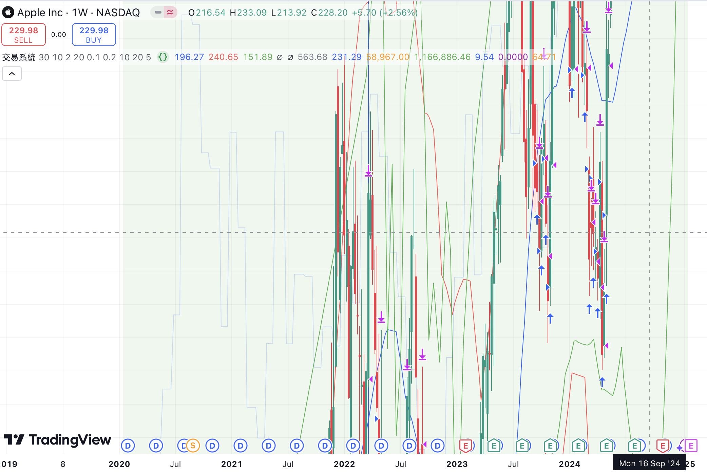

# Trading System Readme

## **Basic Setup**
- Uses a percentage of equity for buying and selling.  
- Includes stop loss, take profit, and max drawdown limits.

## **Indicators**
- 30-month Moving Average (MA).  
- Bollinger Bands for price levels.

## **Buy/Sell Logic**
- **Buy**: When the price is below the MA during the backtest period.  
- **Sell**: When hitting Bollinger Bands, stop loss, or take profit.

## **Performance Tracking**
- Displays equity, drawdown, Sharpe/Sortino ratios, and win percentage.  
- Halts trading if performance drops (e.g., low profitability or high drawdown).

## **Extras**
- Monitors other assets (SPY, GLD, BTCUSD) for diversification insights.

## **Visuals**
- Plots MA, Bollinger Bands, equity curve, and performance metrics on the chart.

 

